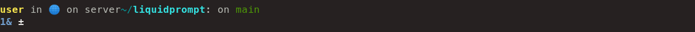
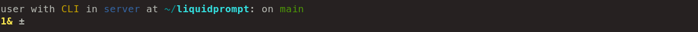
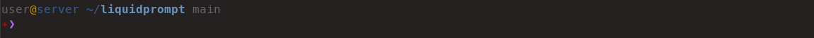
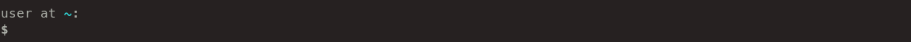
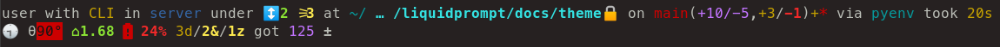
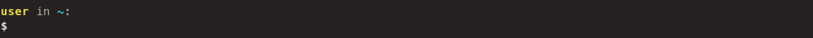
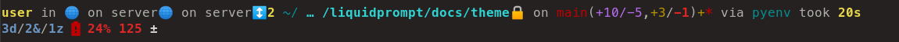
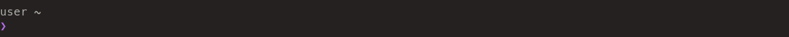
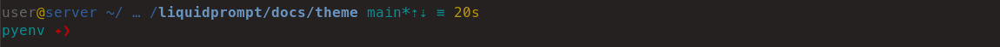

Pureship — a set of Liquid Prompt Themes
========================================

Pureship is a set of 3 themes for [Liquid Prompt](https://github.com/nojhan/liquidprompt).

All of them are emulating the design of other prompt systems,
namely [Starship](https://starship.rs) (and [Spaceship](https://spaceship-prompt.sh),
which share the same design), and [Pure](https://github.com/sindresorhus/pure).


Preview
-------

Spaceship, Starship and Pure all follow the same design principles,
so they all look very similar: that is a two-line prompt,
with foreground-colored sections, separated by preposition words.

The *starship* theme only includes features that have a counterpart in Liquid Prompt.



Whether the *liquidship* integrates the additional features of Liquid Prompt,
plus some changes to have a better (IMHO) ergonomy.



The *pure* theme is almost complete, given that pure targets a very limited subset of features.




Install
-------

Just download this repository somewhere, source the chosen theme file and activate it,
all from your shell configuration file.

For example (just use `~/.zshrc` instead of `~/.bashrc`, if you use Zsh and not Bash):
```sh
git clone https://github.com/nojhan/lp-neon.git
echo '# Use Liquid Prompt only if in an interactive shell
    if [[ $- == *i* ]]; then
        # Use Liquid Prompt
        source ~/.liquidprompt
        # Select the right file below, depending on the theme you want:
        if [[ -f ~/lp-pureship/liquidship.theme ]] ; then
            source ~/lp-pureship/liquidship.theme && lp_theme liquidship
        fi
    fi' >> ~/.bashrc
```


Rationale
---------

All of those themes are two lines, with the majority of information on the top one,
and sections separated by proposition words.
They are thus quite close to the Liquid Prompt default theme.
The main differences are that \*ship themes heavily rely on icons
and tends to be designed as a sequence of icon-name sections.
Liquid Prompt is rather designed as an *integrated* set of information,
and thus tends to be more compact (and have a better user experience, IMHO).

One of the main difference also rely on the fact that \*ship prompts
are themed through a domain-specific descriptive language (using a dialect of JSON),
whether Liquid Prompt allows for using sections tags within a Turing-complete language (the Shell).

Concretely, Liquid Prompt allow for far more degrees of freedom in theming.
You can easily see the result by browsing the diverse set of
[Liquid Prompt's themes](https://github.com/nojhan/liquidprompt/wiki/Themes),
against the very homogeneous [Starship ones](https://starship.rs/presets/#nerd-font-symbols).

Globally, \*ship prompts thus tend to be just a sequenced collection of information.
They also tend to not pay much attention to the location of their sections,
hence having semantically close information (for instance, containers configuration),
spread everywhere.

They also display minor information on the second ("prompt") line, and important one
on the top line, which does not help the user notice important stuff fast.
The *liquidship* theme tries to correct this kind of ergonomic errors (to some extent),
while keeping the \*ship global design approach.


Liquidship theme
================

If there is nothing special about the current context:



If you are running some command in a Git repository:


When Liquid Prompt is displaying a lot of things, it may look like this:




Starship theme
==============

If there is nothing special about the current context:



If you are running some command in a Git repository:


When Liquid Prompt is displaying a lot of things, it may look like this:




Pure theme
==========

If there is nothing special about the current context:



If you are running some command in a Git repository:


When Liquid Prompt is displaying a lot of things, it may look like this:



